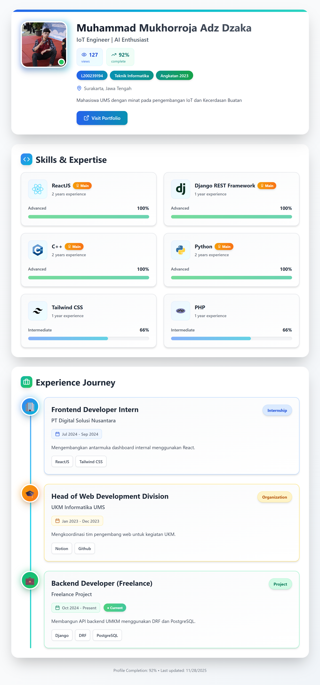

# Deskripsi Aplikasi

Aplikasi ini adalah Single Page Application (SPA) berbasis React.js yang berfungsi sebagai CV online modern untuk menampilkan profil, keahlian, pengalaman kerja, dan statistik pengguna.
Seluruh data diambil dari berkas JSON sehingga mudah diperbarui tanpa mengubah struktur kode.
Aplikasi juga menggunakan Tailwind CSS untuk styling yang responsif dan clean, serta sudah terstruktur menggunakan komponen-komponen terpisah seperti Header, Skills, Experience, dan Statistics.

# Cara Menjalankan Aplikasi
1️⃣ Clone Repository
git clone [<url-repo>](https://github.com/DjackCUY/Tugas-Porto-Single-Page)
cd [<nama-folder>](Tugas-Porto-Single-Page)

2️⃣ Install Dependency
npm install

3️⃣ Jalankan Mode Development
npm run dev

Aplikasi akan berjalan di:

http://localhost:5173/

4️⃣ Build untuk Production
npm run build

5️⃣ Preview Build
npm run preview

# Link Deployment

-> https://tugas-porto-single-page.vercel.app/

# Screenshot Tampilan

